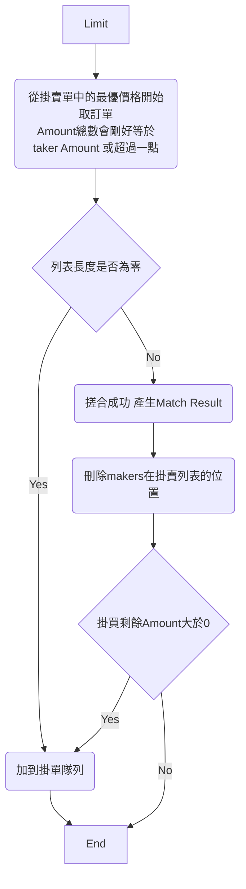
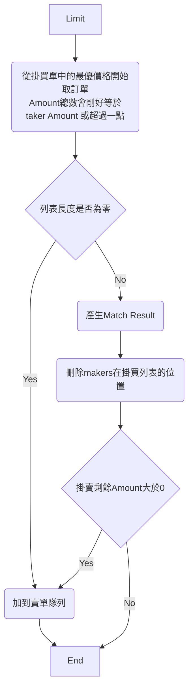

# Trading-Engine
設一個交易撮和引擎來練習System design。

## 如何撮合

限價單(Limit): 當掛單進來時會優先查找低於限價的最優價格，如果有，則依照時間優先來進行數量撮合，如果沒有則放進掛單簿。
### 流程圖
#### 掛買單流程圖

#### 掛賣單流程圖

## 如何設計掛單簿

沒有撮合成功的訂單或者還有數量未撮合完的訂單會放進一個集合中，等待之後的訂單嘗試撮合，我們把這個集合稱為掛單簿(Order Book)。
在掛單簿中會有掛買與掛賣的集合，在單一撮合引擎下我們期望在任何操作速度越快越好，才有辦法負荷大量的訂單近來，因此我們需要一個資料結構來滿足以下需求。

1. 插入與刪除盡可能快。
2. 查詢速度盡可能快。

所以我評估了以下資料結構與演算法，來看何種適合
* n 為資料數量。
* 有兩個時間複雜度時，前者為平均，後者為最差。

| Data Struct | Algorithm | Search | Insert | Remove |
| - | - | - | - | - |
| Array | 線性搜尋 | O(n) | O(n) | O(n) |
| Tree | Binary Search | O(log n) / O(n) | O(log n) / O(n) | O(log n) / O(n) |
| Tree | AVL | O(log n) | O(log n) | O(log n) | 
| Tree | 紅黑樹 RBT | O(log n) | O(1) / O(log n) | O(1) / O(log n) | 

根據以上表格 AVL 與 RBT 可以盡可能做到 log n 的時間複雜度，但在這邊我會選擇 RBT，原因是AVL在樹的高度平衡做的嚴謹，會比RBT多做幾次旋轉，意味著會比較浪費，故選擇紅黑數來當作我的資料結構。

在這邊不自己做輪子，引用了在Github上的開源 [emirpasic/gods](https://github.com/emirpasic/gods?tab=readme-ov-file#redblacktree) 來實現紅黑樹。

根據撮合規定，會有需要價格順序，再來是時間順序，所以我會有一個 `PriceTree` 以紅黑樹來實現，再來每個節點裡都會在放一個 `TimeTree` 也是以紅黑樹來實現，用來排序時間且裡面會放各個Order。

## REF

[AVL Tree](https://zh.wikipedia.org/zh-tw/AVL%E6%A0%91)
[Red Black Tree](https://zh.wikipedia.org/zh-tw/%E7%BA%A2%E9%BB%91%E6%A0%91)