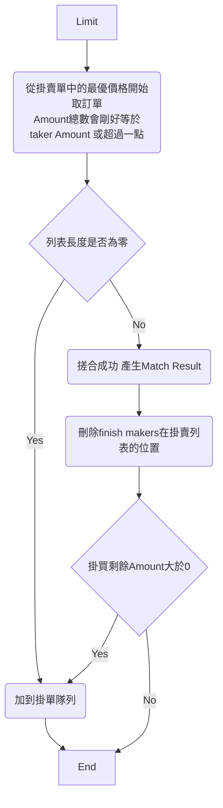
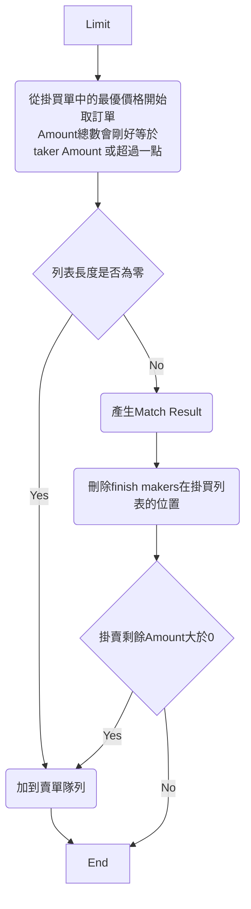
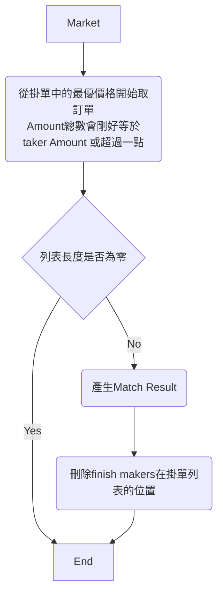

# Trading-Engine
設一個交易撮和引擎來練習System design。


<!-- vscode-markdown-toc -->
* 1. [ Functional Requirements](#FunctionalRequirements)
* 2. [Non-functional Requirements](#Non-functionalRequirements)
* 3. [流程圖](#)
	* 3.1. [限價掛買單流程圖](#-1)
	* 3.2. [限價掛賣單流程圖](#-1)
	* 3.3. [市價單流程圖](#-1)
* 4. [如何設計掛單簿](#-1)
* 5. [技術選型](#-1)
* 6. [API](#API)
* 7. [Project Layout](#ProjectLayout)
* 8. [REF](#REF)

<!-- vscode-markdown-toc-config
	numbering=true
	autoSave=true
	/vscode-markdown-toc-config -->
<!-- /vscode-markdown-toc -->


##  1. <a name='FunctionalRequirements'></a> Functional Requirements

1. [X] 新增限價單、市價單。
2. [X] 刪除掛單。
3. [X] 交易搓合的規則如下:
    限價單(Limit): 當掛單進來時會優先查找低於限價的最優價格，如果有，則依照時間優先來進行數量撮合，如果沒有或者成交數量不足則放進掛單簿。
    市價單(Market): 不指定價格，會依照當時最優價格及時間進行撮合，如果當下沒有完全成交就部分成交，不進入掛單簿。
4. [ ] 能夠向外通知以下事件:
    - 訂單已加入訂單簿
    - 訂單搓合完成
    - 訂單已取消

##  2. <a name='Non-functionalRequirements'></a>Non-functional Requirements

1. [ ] 可用性高 - 程式重啟(意外死掉後 或 正常重開) 可以繼續搓合
                - DONE ~~在每次作動都即時去更新資料庫裡的資料~~
                - TODO 啟動時會去把資料庫裡撈還沒搓合完的資訊


##  3. <a name=''></a>流程圖
###  3.1. <a name='-1'></a>限價掛買單流程圖

###  3.2. <a name='-1'></a>限價掛賣單流程圖


###  3.3. <a name='-1'></a>市價單流程圖




##  4. <a name='-1'></a>如何設計掛單簿

沒有撮合成功的訂單或者還有數量未撮合完的訂單會放進一個集合中，等待之後的訂單嘗試撮合，我們把這個集合稱為掛單簿(Order Book)。
在掛單簿中會有掛買與掛賣的集合，在單一撮合引擎下我們期望在任何操作速度越快越好，才有辦法負荷大量的訂單近來，因此我們需要一個資料結構來滿足以下需求。

1. 插入與刪除盡可能快。
2. 查詢速度盡可能快。

所以我評估了以下資料結構與演算法，來看何種適合
* n 為資料數量。
* 有兩個時間複雜度時，前者為平均，後者為最差。

| Data Struct | Algorithm | Search | Insert | Remove |
| - | - | - | - | - |
| Array | 線性搜尋 | O(n) | O(n) | O(n) |
| Tree | Binary Search | O(log n) / O(n) | O(log n) / O(n) | O(log n) / O(n) |
| Tree | AVL | O(log n) | O(log n) | O(log n) | 
| Tree | 紅黑樹 RBT | O(log n) | O(1) / O(log n) | O(1) / O(log n) | 

根據以上表格 AVL 與 RBT 可以盡可能做到 log n 的時間複雜度，但在這邊我會選擇 RBT，原因是AVL在樹的高度平衡做的嚴謹，會比RBT多做幾次旋轉，意味著會比較浪費，故選擇紅黑數來當作我的資料結構。

在這邊不自己做輪子，引用了在Github上的開源 [emirpasic/gods](https://github.com/emirpasic/gods?tab=readme-ov-file#redblacktree) 來實現紅黑樹。

根據撮合規定，會有需要價格順序，再來是時間順序，所以我會有一個 `PriceTree` 以紅黑樹來實現，再來每個節點裡都會在放一個 `TimeTree` 也是以紅黑樹來實現，用來排序時間且裡面會放各個Order。

##  5. <a name='-1'></a>技術選型

- **Web Framework** 
    此service 當前為了方便送request，故選擇開 http 的接口去收 http request，之後如果轉為內部服務，則會考慮開grpc或者從mq收資料去搓合。

    - `gin`: 由於fiber的案例，原本想找最快的來使用，但還是乖乖選擇最多人使用的老牌框架。

    - ~~`fiber`: 在此選了 fiber 這個框架做使用，原因是在當fiber開啟 prefork 模式時，處理request的效率是最高的，根據[這裡](https://www.techempower.com/benchmarks/#section=data-r22&hw=ph&test=composite&l=zijocf-cn3)。觀察他在Github上的星星樹與還有在維護的部分，選擇`fiber`作為我的web Framework。~~ **發現他其實是開多個process去listen同一個port，但我的訂單簿為了速度快，是放在本地的記憶體，不適合用這個**
- **關連式資料庫**
    - `Mysql` 用來儲存訂單跟交易結果來呈現資料，故選最常用的。

##  6. <a name='API'></a>API

請使用 Postman 導入此[文件](./docs/postman/Trading-Engine.postman_collection.json)


##  7. <a name='ProjectLayout'></a>Project Layout
```
├── build           -- 放置dockerfile
├── cmd             -- 主要的程式
├── configs         -- 配置檔案
├── deployment      -- 部屬檔案的放置
├── docs            -- 文件放置
│   ├── image           -- 圖片
│   └── postman         -- Postman 
├── internal        -- 私有代碼
│   ├── config          -- 配置檔結構及讀取
│   ├── handler         -- 處理路由
│   ├── model           -- 各個模型及功能實現
│   ├── server          -- http
│   └── storage         -- 有關儲存
│       └── mysql           -- mysql的配置
├── pkg             -- 可以讓別人用的
│   └── logger          -- zerolog相關配置
└── test            -- 放unit test的
```
##  8. <a name='REF'></a>REF

[AVL Tree](https://zh.wikipedia.org/zh-tw/AVL%E6%A0%91)

[Red Black Tree](https://zh.wikipedia.org/zh-tw/%E7%BA%A2%E9%BB%91%E6%A0%91)

[gofiber/fiber](https://github.com/gofiber/fiber)

[golang/project-layout](https://github.com/golang-standards/project-layout)